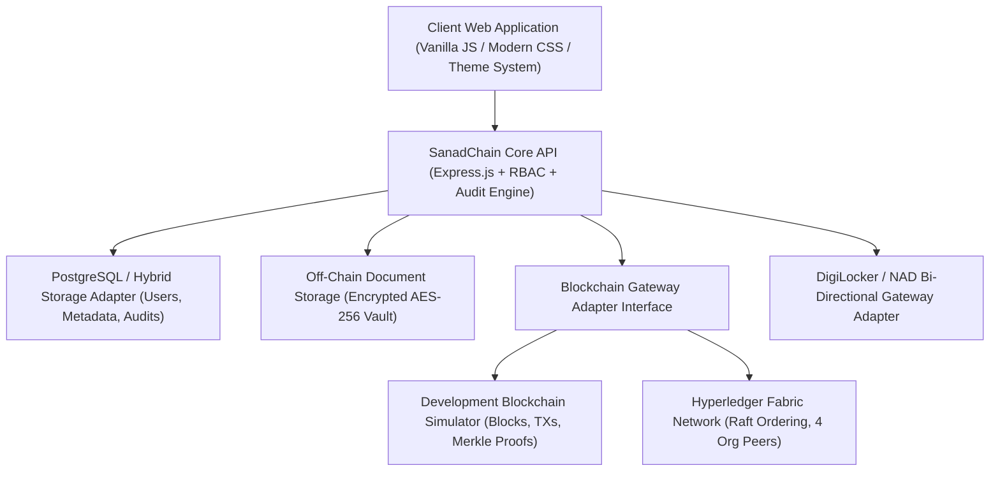
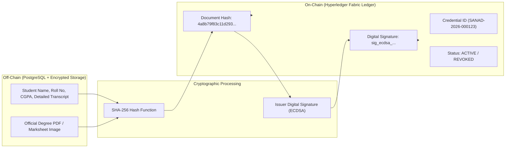
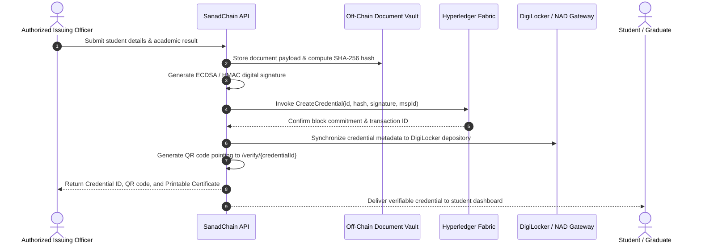
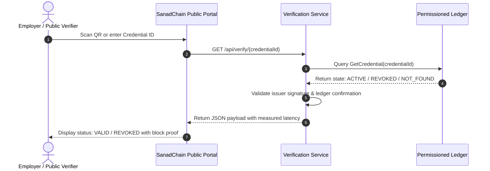
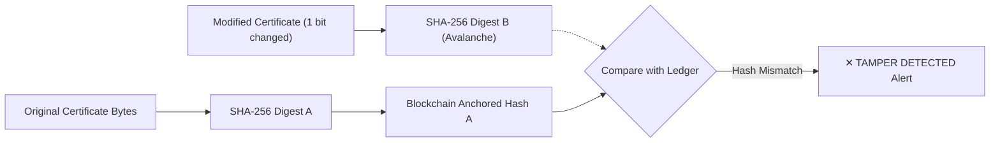
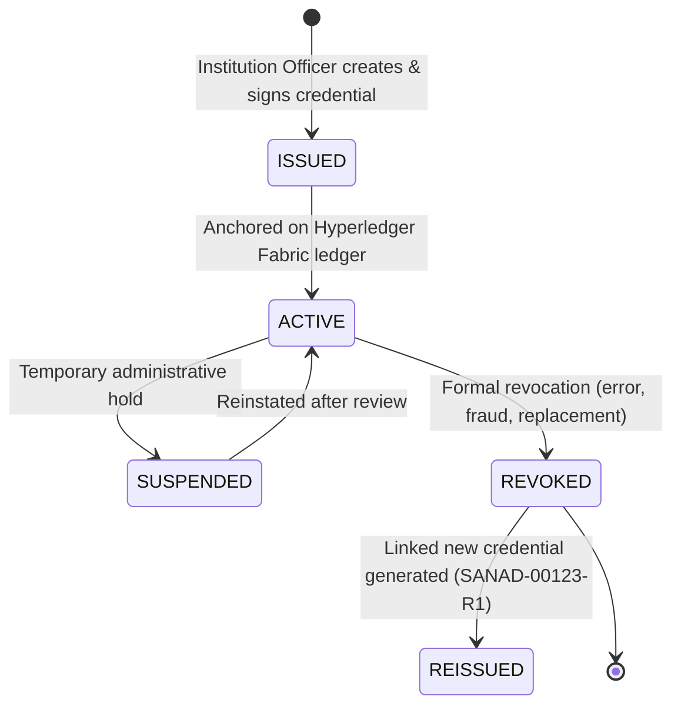
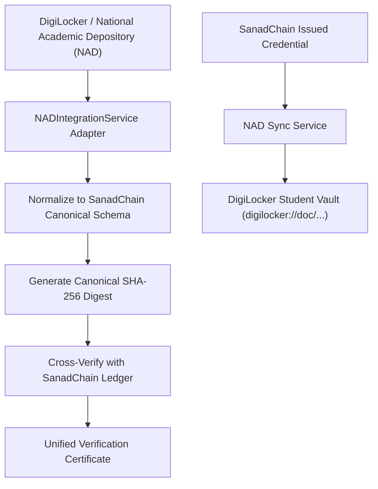

# SanadChain — Architecture & System Design Documentation

## 1. System Architecture Overview

SanadChain is an enterprise-grade, permissioned blockchain academic credential trust platform designed to eliminate degree fraud. Sensitive student records remain off-chain, while cryptographic SHA-256 fingerprints, digital signatures, and lifecycle states are anchored on Hyperledger Fabric.



---

## 2. Federated Multi-Institution Mesh vs Isolated Portals

```
                       ┌────────────────────────────────────────┐
                       │ SANADCHAIN FEDERATED TRUST NETWORK     │
                       │ (Hyperledger Fabric Multi-Org Channel) │
                       └───────────────────┬────────────────────┘
                                           │
         ┌──────────────────┬──────────────┴─────┬──────────────────┐
         ▼                  ▼                    ▼                  ▼
┌─────────────────┐┌─────────────────┐┌─────────────────┐┌─────────────────┐
│ National Auth   ││ University A    ││ University B    ││ Autonomous Coll │
│ (Governance)    ││ (Peer Node)     ││ (Peer Node)     ││ (No-Code Issuing│
└─────────────────┘└─────────────────┘└─────────────────┘└─────────────────┘
```

Unlike single-university portals (which require employers to visit different verification websites for every college), SanadChain provides a **single, universal public verifier** that instantly identifies the issuing institution, verifies the cryptographic signature, checks revocation, and displays authenticity.

---

## 3. Data Privacy: On-Chain vs Off-Chain Separation

To comply with global privacy standards (GDPR / Indian DPDP Act), sensitive personal identifiable information (PII) is strictly stored off-chain.



---

## 4. Credential Issuance Lifecycle Flow



---

## 5. Public Verification Flow (&lt; 1 Second)



---

## 6. Cryptographic Tamper Detection Model



---

## 7. Credential Lifecycle State Transitions



---

## 8. DigiLocker / NAD Interoperability Architecture


