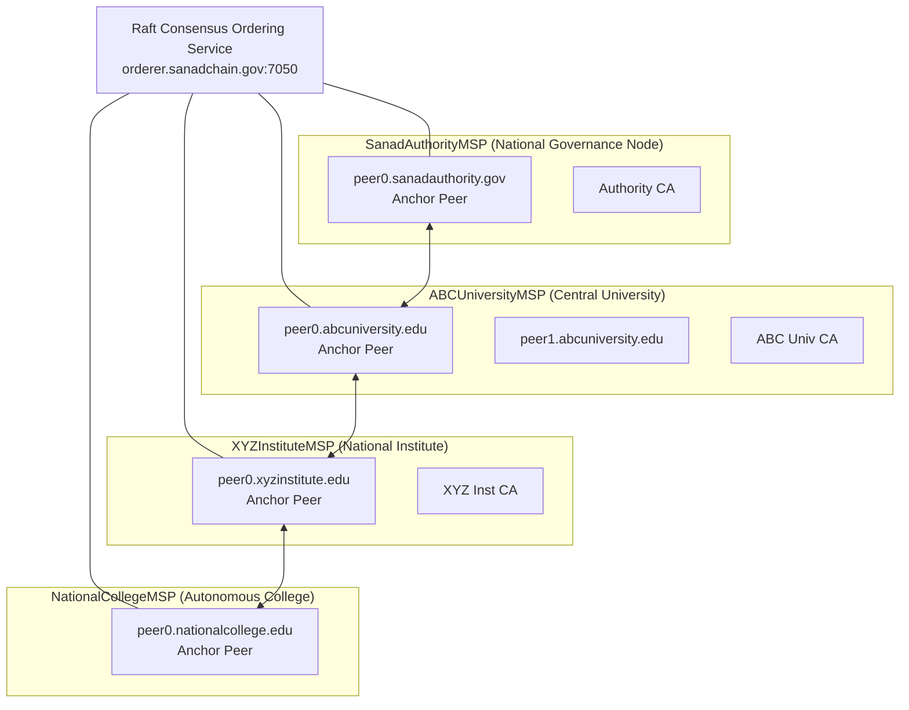

# Hyperledger Fabric & Permissioned Blockchain Architecture — SanadChain

## 1. Executive Summary

SanadChain utilizes a **permissioned distributed ledger architecture based on Hyperledger Fabric 2.5 LTS**. Unlike permissionless networks (Ethereum, Bitcoin, Polygon), SanadChain requires cryptographic institutional identity verification before granting read/write permissions to peer nodes.

---

## 2. Network Topology



---

## 3. Channel Architecture (`sanadchannel`)

* **Channel Name**: `sanadchannel`
* **Endorsement Policy**: `OR('SanadAuthorityMSP.peer', 'ABCUniversityMSP.peer', 'XYZInstituteMSP.peer', 'NationalCollegeMSP.peer')` for credential issuance and public verification queries.
* **Revocation Policy**: `AND('SanadAuthorityMSP.peer', 'IssuingMSP.peer')` or authenticated `IssuingMSP.admin` signature.
* **Block Size**: Max 50 transactions per block or 500ms batch timeout.

---

## 4. Chaincode Smart Contract (`credential-contract`)

The smart contract is implemented in both **Go** (`blockchain/chaincode/credential_contract.go`) and **Node.js** (`blockchain/chaincode/credential-contract.js`).

### Chaincode Data Model:
```json
{
  "credentialId": "SANAD-NAD-20269901",
  "issuerId": "ABC-UNIV-01",
  "institutionCode": "ABC-UNIV-01",
  "institutionName": "ABC University of Technology",
  "studentDisplayName": "Rahul Sharma",
  "studentReference": "STU-2026-00123",
  "credentialType": "Degree",
  "program": "Bachelor of Technology in Computer Science & Engineering",
  "graduationYear": 2026,
  "academicResult": "CGPA 9.24 / 10.0 (First Class with Distinction)",
  "documentHash": "2dd213a416bb2f5a6ed5fa8e20dcc7e8a056aab719c45e86bc03c15ef0e3ea38",
  "digitalSignature": "sig_ecdsa_2550ed42b89a519fba7e6c87c343e083228f",
  "issueDate": "2026-06-20",
  "status": "ACTIVE",
  "revocationReason": null,
  "revokedAt": null,
  "reissuedToId": null,
  "reissuedFromId": null,
  "blockNumber": 1848,
  "transactionId": "tx_fabric_4cb9749c3234657487973b68a80d8ac8",
  "source": "DIGILOCKER_NAD"
}
```

### Supported Smart Contract Operations:
1. `CreateCredential(ctx, credentialJSON)` — Anchors new credential after validating issuer MSP identity.
2. `GetCredential(ctx, credentialId)` — Reads state from World State (LevelDB/CouchDB).
3. `VerifyCredential(ctx, credentialId, clientComputedHash)` — Validates hash equality and status.
4. `RevokeCredential(ctx, credentialId, reason, actor)` — Sets status to `REVOKED` without deleting history.
5. `ReissueCredential(ctx, oldId, newCredentialJSON, reason)` — Maintains cryptographic parent-child link.
6. `GetCredentialHistory(ctx, credentialId)` — Returns complete audit trail of state transitions.

---

## 5. Development Mode vs Hyperledger Fabric Gateway

SanadChain supports an automatic dual-mode architectural seam:

| Mode | Trigger | Behavior | Transparency |
| :--- | :--- | :--- | :--- |
| **Demo Mode (Default)** | `MOCK_BLOCKCHAIN=true` | In-memory distributed ledger simulator with real block increments, Merkle digests, and ECDSA signatures. | Clearly labeled `"Mode: Development Blockchain Simulator"` |
| **Fabric Gateway** | `MOCK_BLOCKCHAIN=false` | Connects via `@hyperledger/fabric-gateway` gRPC client to Docker network. | Labeled `"Mode: Hyperledger Fabric Gateway"` |
