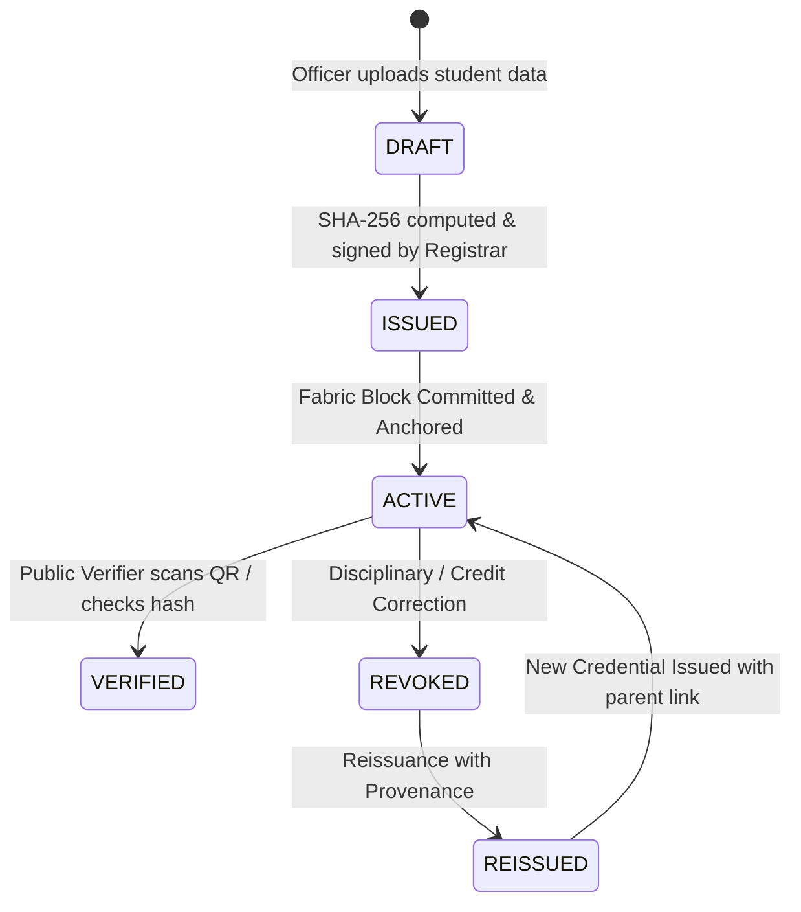

# Credential Lifecycle & Provenance State Machine — SanadChain

## 1. Lifecycle State Machine

---

## 2. Reissuance Provenance Model

When a credential is corrected or updated:
1. The original credential (`SANAD-2026-000123`) is marked **`REVOKED`** on the blockchain with reason *"Official correction of department elective credits; superseded by revised re-issue"*.
2. A new credential (`SANAD-2026-000123-R1`) is minted with an explicit `reissuedFromId` field.
3. The old credential records `reissuedToId: "SANAD-2026-000123-R1"`.
4. Anyone querying either record sees the complete chain of custody.
