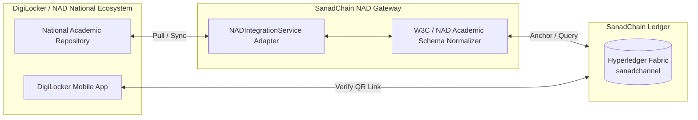

# DigiLocker & National Academic Depository (NAD) Gateway — SanadChain

## 1. National Integration Architecture

---

## 2. Bi-Directional Synchronization Features

1. **Pull & Import**:
   - Query students' DigiLocker records via `GET /api/nad/credentials`.
   - 1-Click convert DigiLocker XML/JSON records into SanadChain verified credentials and anchor them onto Hyperledger Fabric.
2. **Push to DigiLocker**:
   - Push newly issued university degrees to the citizen's government wallet.
   - Generates official URI: `digilocker://in.gov.sanadchain/doc/DL-DOC-...`.
3. **Dual Verification**:
   - Public verifiers can verify both native SanadChain and imported DigiLocker documents in the same interface.
