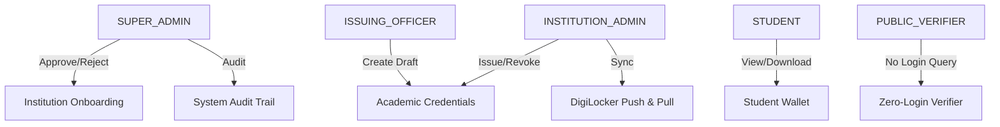

# Cybersecurity, Cryptography & Threat Modeling — SanadChain

## 1. Security Philosophy

SanadChain enforces a **defense-in-depth, zero-trust security model** specifically engineered to eliminate diploma fraud, grade modification, and institutional identity spoofing.

---

## 2. Cryptographic Pillars

### A. SHA-256 Cryptographic Hashing
* Every student marksheet, degree certificate, and transcript produces a deterministic 256-bit hash.
* Modifying even a single character in a student's CGPA or name creates an avalanche effect:
  ```text
  Original: "Rahul Sharma: CGPA 9.24" -> 2dd213a416bb2f5a6ed5fa8e20dcc7e8a056aab719c45e86bc03c15ef0e3ea38
  Tampered: "Rahul Sharma: CGPA 9.99" -> 19ad7281f83c11d29381e4a5bf607183e95bc7291a27e4c9e88d0172bf42589e
  Result:   ✕ TAMPER DETECTED (Mismatched hash flagged in 0.001s)
  ```

### B. Elliptic Curve Digital Signatures (ECDSA)
* Issuing registrars sign the computed SHA-256 digest using their institution's cryptographic private key.
* The digital signature (`sig_ecdsa_...`) guarantees **non-repudiation** — an institution cannot claim a credential was forged if signed by their active registrar key.

---

## 3. Data Privacy & Off-Chain Architecture

| On-Chain (Hyperledger Fabric Ledger) | Off-Chain (Encrypted Document Vault & DB) |
| :--- | :--- |
| • Credential ID (`SANAD-NAD-20269901`) | • Student Full Name & Roll Number |
| • Document SHA-256 Digest | • High-Resolution Certificate PDF/PNG Documents |
| • Issuer Digital Signature | • Course-by-Course Marksheets & Transcripts |
| • Block Height & Timestamp | • User Account Passwords (bcrypt hashed) |
| • Status (`ACTIVE` / `REVOKED`) | • Internal University Registrar Department Notes |

> **Privacy Rule**: Under no circumstances is personally identifiable information (such as Aadhaar, phone numbers, or residential addresses) stored on the immutable blockchain ledger.

---

## 4. Threat Modeling & Mitigation Matrix

| Threat / Attack Vector | Risk Level | Mitigation Strategy in SanadChain |
| :--- | :---: | :--- |
| **Photoshop Grade Forgery** | Critical | SHA-256 hash recalculation flags mismatched bit sequence immediately. |
| **Fake University Certificate** | High | AI Accreditation Scanner cross-checks issuing code against UGC/AICTE registry. |
| **Malicious QR Code Phishing** | High | Scanner rejects external/untrusted domains, accepting only `/verify/{id}` paths. |
| **Stolen Registrar Session** | High | 2FA OTP verification required for credential issuance and revocation actions. |
| **Replay Attacks on OTP** | Medium | In-memory cryptographic OTP store enforces one-time use with 5-minute TTL. |
| **Denial of Service / Scraping** | Medium | Rate limiting, CORS restrictions, and helmet security headers enabled on all endpoints. |

---

## 5. Role-Based Access Control (RBAC)


